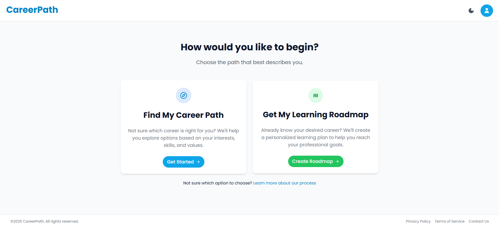
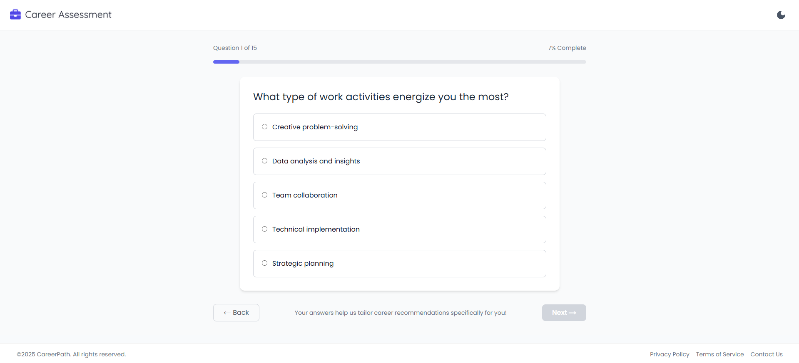
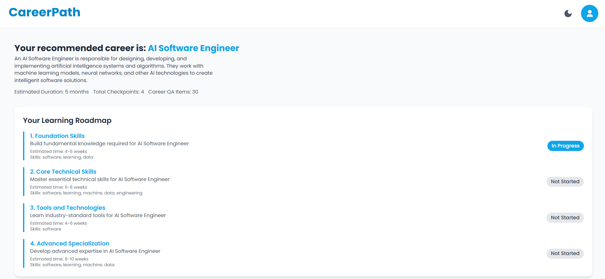
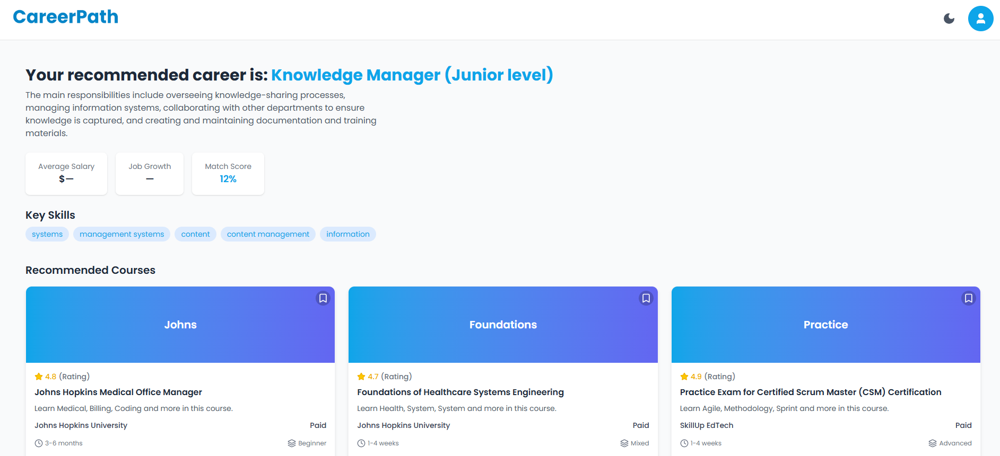

<div align="center">
  <h1>CareerPath</h1>
  <h3>Map Your Journey. Build Your Career.</h3>
  <p><em>This project was developed for <strong>Final Project – Sister in Tech: Frontend Engineering</strong></em></p>
  <p>
    
    
    
    
    </p>
  
</div>


## 📖 Description
**CareerPath** is a career discovery and learning roadmap web application designed to help users identify suitable career paths through personalized assessments. By analyzing user preferences and strengths, CareerPath generates tailored career recommendations and connects users with curated online courses to support their growth. Built with Next.js, Tailwind CSS, and FastAPI, it offers a seamless experience for planning, exploring, and progressing along your professional journey.

## ✨ Key Features

- 🧭 **Career Assessment**: Discover your ideal career path through personalized quiz-based evaluations  
- 🎓 **Learning Roadmap**: Get curated course recommendations aligned with your selected career  
- 🔍 **Dynamic Routing**: Smooth and intuitive navigation using Next.js App Router  
- 👤 **User Authentication**: Secure login and registration system using JWT tokens  
- 💾 **Save Courses**: Bookmark your favorite courses for future access  
- 🔎 **Course Filtering**: Easily filter recommended courses by difficulty, duration, or organization  
- 📱 **Responsive Design**: Fully optimized for mobile, tablet, and desktop views  
- ⚙️ **FastAPI Backend**: Efficient and scalable API integration for data processing  
- 🎨 **Clean UI**: User-friendly interface built with Tailwind CSS for modern usability

## 📁 Project Structure
```
CareerPath
├── docs/                   # Project documentation (screenshots, notes)
│
├── public/                 # Public assets (logo, UI images, etc.)
│ ├── assessment.png
│ ├── logo.png
│ └── register.png
│
├── src/
│ ├── app/                  # App Router structure 
│ │ ├── assessment/         # Career assessment quiz page
│ │ │ ├── components/
│ │ │ │ ├── navbar.tsx
│ │ │ │ └── questionCard.tsx
│ │ │ └── page.tsx
│ │ │
│ │ ├── chooseCareer/       # Page to select a career 
│ │ │ ├── components/
│ │ │ │ └── card.tsx
│ │ │ └── page.tsx
│ │ │
│ │ ├── dashboard/          # User dashboard after login
│ │ │ └── page.tsx
│ │ │
│ │ ├── career/             # Career recommendations & course info
│ │ │ ├── careerclient/     # Fetch logic for career data
│ │ │ │ └── page.tsx
│ │ │ ├── components/
│ │ │ │ ├── CourseCard.tsx
│ │ │ │ └── navbar.tsx
│ │ │ └── page.tsx
│ │ │
│ │ ├── components/         # Reusable Components
│ │ │ ├── CareerSummary.tsx
│ │ │ └── CourseCard.tsx
│ │ │
│ │ ├── landingPage/        # Main landing page
│ │ │ ├── components/
│ │ │ │ ├── card.tsx
│ │ │ │ └── navbar.tsx
│ │ │ └── page.tsx
│ │ │
│ │ ├── login/              # Login page
│ │ │ └── page.tsx
│ │ │
│ │ ├── favicon.ico 
│ │ ├── globals.css         # Global styling
│ │ ├── layout.tsx          # Global layout
│ │ └── page.tsx            # Root page (register)
│
├── components/             # Additional reusable components
├── node_modules/           # Project dependencies
└── README.md               # Main project documentation
```

## 📸 Screenshots

<div align="center">
  <table>
    <tr>
      <td align="center">
        
        <br><b>Assessment Page</b>
      </td>
      <td align="center">
        
        <br><b>Career Page</b>
      </td>
      <td align="center">
        
        <br><b>Recommended Result Page</b>
      </td>
    </tr>
  </table>
</div>


## 🛠️ Requirements

To run this project locally, make sure you have the following installed:

1. Node.js (v18 or later recommended)

2. npm or yarn


## 🎯 How to Run
1. Clone the repository and open the project folder:
   ```
    git clone https://github.com/mineraleee/CareerPath
    cd CareerPath
   ```
2. Navigate to the src directory:
   ```
    cd src
   ```
3. Install dependencies
   ```
    npm install
   ```
4. Run the development server
   ```
    npm run dev
   ```
The app will start on http://localhost:3000

## 🌐 Deployment
You can access the deployed version of this project here: https://career-path-sistech.vercel.app/  

## 👨‍💻 Author
<table>
  <tr>
    <td align="center">
      <a href="https://github.com/mineraleee">
        <br />
        <span><b>Heleni Gratia</b></span>
      </a>
    </td>
    <td align="center">
      <a href="https://github.com/Kellycing22">
        <br />
        <span><b>Kelly Hermanto</b></span>
      </a>
    </td>
  </tr>
</table>


<div>
  <strong>Sister in Tech FE Engineering</strong><br>
  <em>CareerPath</em>
</div>